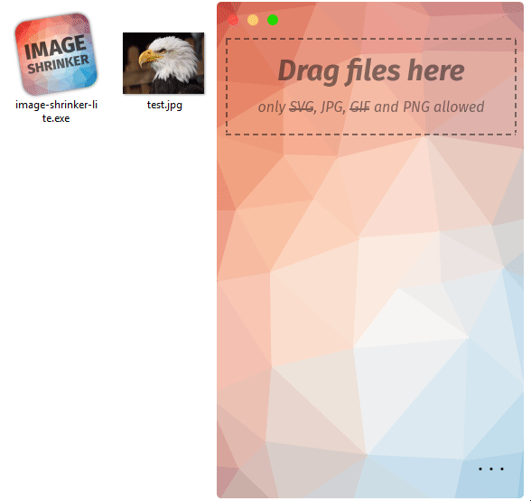

# Image Shrinker Lite

Image Shrinker Lite is a tool to minify images and graphics. Built with web technologies in [Sciter](https://sciter.com), it is a lightweight clone of the original [Image Shrinker](https://github.com/stefansl/image-shrinker) for Windows and, hopefully, Linux & Mac.

## Features 

- [x] PNG compression
- [x] JPG compression
- [ ] SVG compression
- [ ] GIF compression
  
## Building 

  
<b>Windows</b>

1. Install [Rust](https://www.rust-lang.org/tools/install).

2. Download[packfolder.exe](https://github.com/c-smile/sciter-sdk/blob/master/bin.win/packfolder.exe).

3. Add it to your `PATH`.
  
4. Download [sciter.dll](https://github.com/c-smile/sciter-sdk/blob/master/bin.win).

5. Add it to your `PATH`.  Or, place it in this folder.
   
6. Run `cargo run` to build and execute from the command line.  Or, `cargo build --release` to create an optimized executable in `target/release`.

  
<b>Mac</b>

  Pending ...

  
<b>Mac</b>

  Pending ...

## Credits
Thank you, guys!
* Sciter: <https://sciter.com>
* Sciter Rust bindings <https://crates.io/crates/sciter-rs>
* imagequant <https://crates.io/crates/imagequant>
* mozjpeg <https://crates.io/crates/mozjpeg>
* Poly background: <http://alssndro.github.io/trianglify-background-generator>
* CSS: [Spectre Css](https://picturepan2.github.io/spectre/)
* Font: [Mozillas Fira Sans](https://github.com/mozilla/Fira)
* Moveable window: [Sciter-MovableView](https://github.com/MustafaHi/Sciter-MovableView)