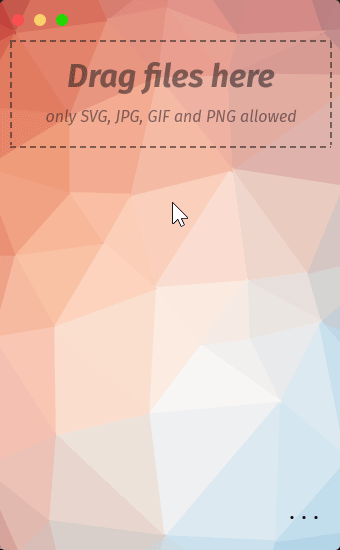

# Image Shrinker Lite

## 🚧 Under Construction! 🏗️

Image Shrinker Lite is a tool to minify images and graphics. Built with web technologies in [Sciter](https://sciter.com), it is intended to be a lightweight clone of the original [Image Shrinker](https://github.com/stefansl/image-shrinker) for Windows and Linux in addition to Mac.

<h1 align="center">
</a>  
</h1>

## Usage

  
<b>GUI Only</b> (No Compression Functionality)

  Download the Sciter binary appropriate for your operating system here:

  - [Windows](https://github.com/c-smile/sciter-sdk/blob/master/bin.win/x32/scapp.exe)
  - [Mac](https://github.com/c-smile/sciter-sdk/tree/master/bin.osx)
  - [Linux](https://github.com/c-smile/sciter-sdk/blob/master/bin.lnx/x64/scapp)

  Then run it inside the [lite](lite) folder.

  
(Partially) <b>Functional</b>

  
  Download the Sciter library appropriate for your operating system here:

  - [Windows](https://github.com/c-smile/sciter-sdk/blob/master/bin.win/x32/sciter.dll)
  - [Mac](https://github.com/c-smile/sciter-sdk/blob/master/bin.osx/sciter-osx-64.dylib)
  - [Linux](https://github.com/c-smile/sciter-sdk/blob/master/bin.lnx/x64/libsciter-gtk.so)

  Place it inside the [lite](lite) folder, and run `cargo build --release` from a console window there.

  Then find the resulting executable in the `target` folder, and run it directly.

  Running it from a command line will result in the file drag-and-drop functionality not working.

  This assumes you have the Rust toolchain installed.

## Credits
Thank you, guys!
* Sciter: <https://sciter.com>
* Sciter Rust bindings <https://crates.io/crates/sciter-rs>
* Poly background: <http://alssndro.github.io/trianglify-background-generator>
* CSS: [Spectre Css](https://picturepan2.github.io/spectre/)
* Font: [Mozillas Fira Sans](https://github.com/mozilla/Fira)
* Moveable window: [Sciter-MovableView](https://github.com/MustafaHi/Sciter-MovableView)